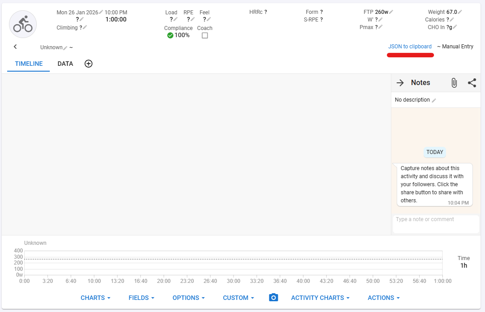

# Intervals.icu - JSON to Clipboard (Chrome Extension)

A lightweight Chrome extension that adds a **“JSON to clipboard”** button to the Intervals.icu activity page, so you can export an activity’s key data in one click and paste it anywhere (for example into AI tools for analysis).

> [!NOTE]
**Unofficial project** - this extension is not affiliated with, endorsed, or sponsored by Intervals.icu.

## Status / Roadmap

- Current: manual installation (unpacked).
- Next: I will publish this extension on the **Chrome Web Store soon** .

## Permissions & Privacy

This extension is designed to be minimal and transparent:

- **Data access:** Reads data that is already available on the Intervals.icu activity page you are viewing.
- **Clipboard:** Writes to the clipboard only when you click the button.

> [!NOTE]
> No data is sent to external servers; all processing happens locally in your browser.

## Requirements

- Google Chrome (or Chromium-based browser) with extension support.
- Developer Mode enabled for unpacked installation (testing).

## Installation (for testers)

1. Download the repository as a ZIP and extract it (or clone it locally).
2. Open Chrome and navigate to `chrome://extensions`.
3. Enable **Developer mode** (toggle in the top-right).
4. Click **Load unpacked**.
5. Select the extracted project folder (the one containing `manifest.json`).
6. The extension should now appear in the extensions list.

### Updating after changes

- If you pull new changes or replace files, go to `chrome://extensions` and click **Reload** on the extension card.

## Usage

1. Ensure the extension is enabled.
2. Navigate to an **activity page** on Intervals.icu.
3. A **“JSON to clipboard”** button will appear near the other action buttons.
4. Click it: the button should briefly show “Copied!”.
5. Paste (Ctrl/Cmd+V) into your editor or AI tool.

## Troubleshooting

- **Button doesn’t appear:** Confirm you are on an Intervals.icu *activity* page (not a dashboard/list page) and refresh the page.
- **Icon not visible in toolbar:** Open the extensions “puzzle” menu and pin the extension.
- **Changes not taking effect:** Reload the extension from `chrome://extensions` and refresh the Intervals.icu tab.
- **Clipboard doesn’t update:** Make sure you clicked the button (clipboard write is user-triggered) and check DevTools console for errors.

## Contributing

PRs and issues are welcome.

When reporting bugs, please include:
- Chrome version
- Extension version/commit
- The Intervals.icu URL
- Console errors (if any)
- Screenshot/video if it helps

## License

This project is licensed under the MIT License.

## Disclaimer
This extension may break if Intervals.icu changes its UI or page structure. If you encounter any problems, please report them by opening an issue.
